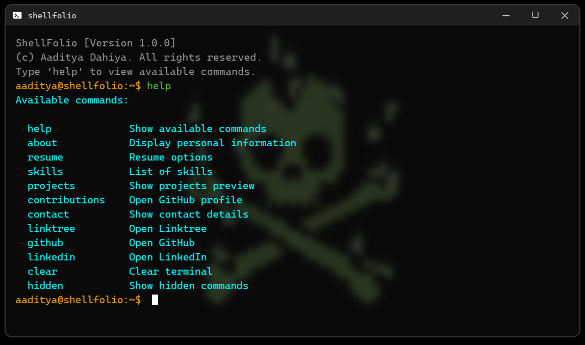

# ShellFolio

 An interactive browser-based terminal portfolio built with <b>Vanilla JavaScript</b>. 
 
     

## Overview

This project simulates a real command-line interface inside the browser, allowing users to explore my portfolio through terminal-style commands.

It is designed to demonstrate:

- Strong JavaScript fundamentals
- State management and UX handling
- Custom cursor rendering logic
- Intelligent error recovery
- Clean frontend architecture

Unlike static portfolios, this project focuses on interaction design and engineering depth.

## Live Demo

https://itsaadityadahiya.github.io/ShellFolio

## Key Features

### 1. Intelligent Command Handling

- Live typing validation (valid/invalid states)
- Tab auto-completion with ghost text
- Smart “Did you mean?” suggestions using Levenshtein Distance

### 2. Advanced History System

- Arrow ↑ / ↓ navigation
- Unique command storage (no duplicates)
- Restore partially typed commands during navigation
- history command
- history -c command

### 3. Real Terminal Behavior

- Custom blinking cursor synced with real caret
- Scroll management
- Command execution feedback
- Structured help menu

### 4. Hidden Commands

- Easter egg commands
- Simulated system responses

## Tech Stack

| Technology         | Purpose                       |
| ------------------ | ----------------------------- |
| HTML5              | Structure                     |
| CSS3               | Custom UI Styling             |
| Vanilla JavaScript | Core Logic & State Management |
| Levenshtein Algo   | Intelligent Error Suggestions |
| DOM Manipulation   | Dynamic Terminal Rendering    |

Built entirely with Vanilla JavaScript to demonstrate deep understanding of core frontend fundamentals without framework abstraction.

## Architecture Overview

The project is structured around:

- Command Registry Object
  Centralized command management system

- Custom Cursor Engine
  Manual caret tracking using text width calculation

- History State Controller
  Unique storage + temporary buffer for proper navigation

- Error Suggestion Engine
  Edit distance algorithm for intelligent recovery

This keeps the system modular and scalable.

## Available Commands

| Command         | Description                     |
| --------------- | ------------------------------- |
| `help`          | Show available commands         |
| `about`         | Display personal information    |
| `resume`        | Resume options (view/download)  |
| `skills`        | List of skills                  |
| `projects`      | Show project previews           |
| `contributions` | Open GitHub profile             |
| `contact`       | Display contact details         |
| `linktree`      | Open Linktree                   |
| `github`        | Open GitHub profile             |
| `linkedin`      | Open LinkedIn profile           |
| `clear`         | Clear terminal                  |
| `hidden`        | Show hidden/easter egg commands |

## Example Interaction

| Input     | Output                          |
| --------- | ------------------------------- |
| `helpp`   | `Did you mean 'help'?`          |
| `history` | Shows list of executed commands |

## Preview

Add a screenshot here:

## Why This Project Matters

This project demonstrates:

- Algorithm implementation in frontend applications
- UX-focused engineering
- State management without frameworks
- Real-world interaction simulation
- Clean code organization

It reflects both technical depth and creative product thinking.

## Future Improvements

- Local Storage persistence
- Command argument parsing
- Modular command plugin system
- Theme switching

## Contact

Aaditya Dahiya

Email: iamaadityadahiya@gmail.com

LinkTree: https://linktr.ee/aadityadahiya

LinkedIn: https://www.linkedin.com/in/iamaadityadahiya

GitHub: https://github.com/ItsAadityaDahiya

## License

This project is licensed under the MIT License.
